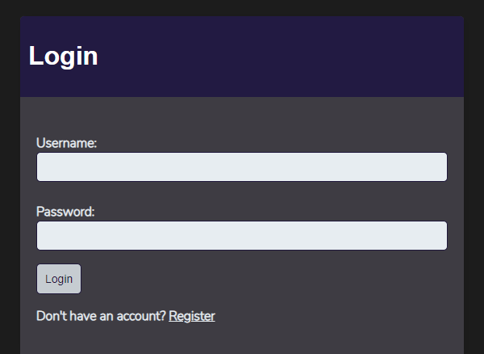
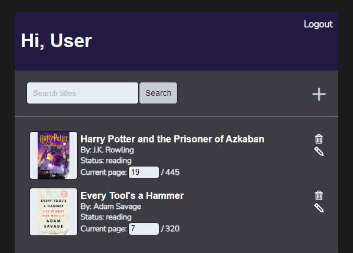
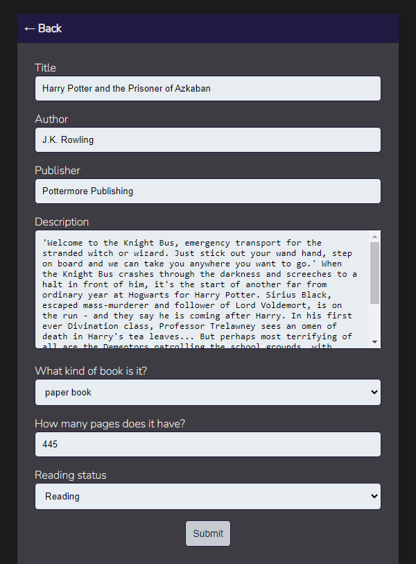

# Reading Tracker

  A Django application to track your reading.

## Features

* __Search Functionality__: Users can search for books by title, author, publisher, subject, ISBN, OCCN or OCLC.
* __Book Details__: Displays comprehensive information about each book, sourced from the Google Books API, including cover images, descriptions, and publication details.
* __Mobile Compatability__: Responsive design ensures the website is accessible and user-friendly on both desktop and mobile devices, allowing users to track their reading on the go.
* __Reading Lists__: Allow users to create personalized reading lists to organize books they want to read, are currently reading, or have finished reading.
* __Progress Tracking__: Enable users to track their reading progress for each book, such as marking pages read or time listened.
* __User Profiles__: Enable users to create profiles where they can track their own individual reading history.

## Screenshots

Login Page

Book List Page

Book Search Page

Book Create Page

## Technologies Used

* Python
* JavaScript
* Django
* Google Cloud Platform (GCP)
  * Cloud Run
  * Cloud SQL (PostgreSQL)
  * Cloud Storage Buckets
  * Cloud Secrets
* Docker
* Gunicorn
* Google Books API

## Setup

This repo is currently set up to be run on Google Cloud Platform in accordance with [this documentation](https://cloud.google.com/python/django/run).

If you would like to run this program locally, you can either use the instructions provided in the docs above to utilize GCP services, or you can fork this repo, remove its GCP dependencies, run `pip install -r requirements.txt` in the terminal of your choice, and do your usual

`python manage.py makemigrations`

`python manage.py migrate`

`python manage.py collectstatic`

`python manage.py runserver`

## Contact

[Check out my other projects!](https://github.com/ethan-pt)

[Send me an Email!](mailto:tubbeethan@gmail.com)
